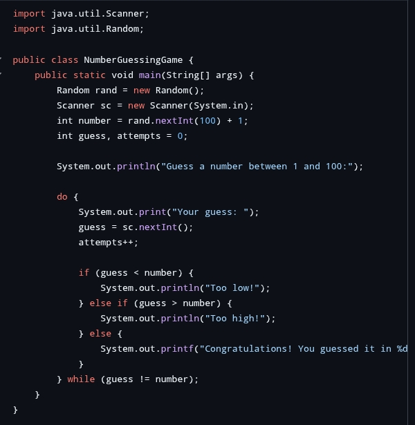
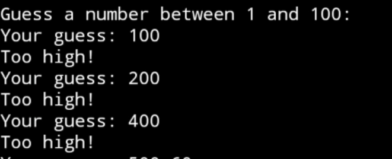

# Prodigy-infotech-task-2
Software development internship 

# Prodigy Infotech Internship - Task 2

## 💼 Internship Domain:
**Software Development Internship**  
**Organization:** Prodigy Infotech

## 📌 Task 2: Guess the Number Game (Java)

This project is a **console-based number guessing game** developed using Java. The program randomly generates a number between 1 and 100. The user must guess the number with feedback on whether the guess is too high or too low, until the correct number is guessed.

---

## 🎯 Features

- Random number generation using `java.util.Random`
- User input via `Scanner`
- Looping with feedback until correct guess
- Tracks number of attempts

---

## 📂 Project Structure

Prodigy-infotech-task-2/ ├── Task2.java ├── README.md ├── Screenshot_2025-07-29-15-30-45.jpg ├── Screenshot_2025-07-29-15-33-57.jpg

---

## 🖼️ Screenshots

### ✅ Game Execution Output


### ✅ Successful Guess


---

## 🧪 How to Run

1. Clone or download this repository.
2. Open the `Task2.java` file in your preferred Java IDE (e.g., IntelliJ, Eclipse) or terminal.
3. Compile the program:
   ```bash
   javac Task2.java

4. Run the program:

java Task2


---

🧠 Skills Demonstrated

Java fundamentals (variables, loops, conditionals)

Random number generation

User input handling

Logic building and validation


---

🔗 Connect with Me

🔹 LinkedIn
🔹 GitHub


---

© 2025 Aravind Kumar | All rights reserved.
